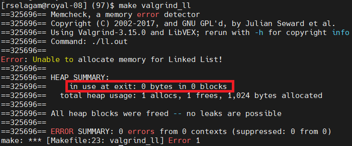
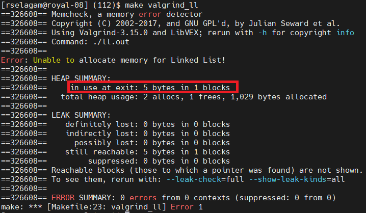

# Project 2: Linked List

In this project you will be implementing a linked list that will be used to complete statically sized hash table.

## Learning Goals

The purpose of this assignment is to quickly become good at writing C programs, gaining the experience of working in a non-object oriented language. By the end of this assignment you should be comfortable with pointers, and structures in C. You will learn how to implement a linked list and some of its basic operations such as list traversal, node addition, node deletion, and (potentially) sorting a linked list.

## Specifications

In this project, you will complete six functions. Starter code for the functions can be found in the file [ll\_functions.c](src/ll_functions.c). Please see this template file for the exact function descriptions and specifications.  

* LL\_Init(...) initializes your linked list data structure with calls to `malloc`.
* LL\_Insert(...) inserts a node into the list. A node is defined as a (key, value) pair.
* LL\_Size(...) returns the number of nodes in a linked list.
* LL\_Get(...) retrieves a value from the linked list, if the search key is present in one of it's nodes.
* LL\_Remove(...) deletes a node from the linked list, if the search key is present in one of it's nodes.
* LL\_Free(...) frees all memory allocated from LL\_Init(...).

The primary data structure used is declared in [ll\_structs.h](inc/ll_structs.h). Note that this file may not have everything you need. Feel free to add any other fields you might need.

### Libraries

All libraries needed for the completion of this have been included for you already. It is not permitted to use any external C libraries beyond those present in the starter files.

### Memory Leaks

Your code must terminate with no memory leaks. See the Valgrind section below for more details on how to check your program for memory leaks.

### Git Commit History

Please develop and checkpoint your code incrementally. If you only wait till that last minute to commit and push all your changes, you are not taking advantage of the useful checkpointing features Git provides. When grading, we will be looking at your git log for meaningful commit messages. I recommended pushing a commit after you finish a function. 

## Files

[hash\_table.c](src/hash_table.c) your code should work with the original version of this file

[hash\_table.h](inc/hash_table.h) header file for the hash table

[ht\_main.c](drivers/ht_main.c) a simple driver file for the hash table implementation

[ll\_functions.c](src/ll_functions.c) **One of the the main files you'll be working in**

[ll\_functions.h](inc/ll_functions.h) **The other file you might modify**

[ll\_main.c](drivers/ll_main.c)  simple driver file to test your linked list implementation

[ll\_structs.h](inc/ll_structs.h) modify the linked list structs here

[Makefile](Makefile) simple makefile to make compiling and using Valgrind easier

[stress.c](drivers/stress.c) driver used for benchmarking your solution

It is strongly encouraged that you thoroughly test your implementations. Feel free to share your test inputs on Piazza.

## Compiling and Running on Your Own

### Compiling

If you decide to test code on a CSL machine (either in-person in the labs or via ssh), you can use the following commands to test your code:

`make` 

This command will build object files for all the poritons of code: `ll.out`, `ht.out` and `stress.out`. Note that to get all the points in the assignment, your code must compile without any warnings or errors from running this command.

### Running

To actually run these drivers, you would simply invoke the final binaries:

`./ll.out`

`./ht.out`

`./stress.out`

The `ll.out` and `ht.out` drivers run some **very** basic tests just to ensure minimal functionality. It is strongly encouraged that your write your own tests for the linked list data structure. Note that you should **only** test the `stress.out` program if you are confident that your linked list implementation is correct and free of memory leaks.

## Strategy

Write your code in small pieces and test each line written by printing out a message.  This technique is called scaffolding. Remove the debugging messages after you verify the success of your code.

## Turn in

As mentioned in class, you **must** tag your submission to ensure that we grade it. Once you are satisfied with your progress, you can submit using the commands shown below. Since many people submitted early, they wanted to go back and modify their solution after tagging it. To ensure that the teaching staff doesn't have to manually go through and delete tags, we will allow multiple submissions. I.e., you commit histroy can contain multiple tags. However, the tag must start with the prefix `FINAL` for us to count it as a submission. As an example, let's say you submitted your assignment and pushed the tag `FINAL000`. However, after reading some piazza posts, yourealize that you need to go an change your solution. Once you have made the chages, added, committed, and pushed them, please push **another** tag, `FINAL001`. When we grade, we will checkout to the tag with the highest number in the suffix. So for your first submission, you would use that following commands:

`git tag -a "FINAL000" -m "Submitting my work"`

`git push origin FINAL000`

And if you needed to make changes after the deadline, you could submit your next attempt with:

`git tag -a "FINAL001" -m "Oops, ade a mistake in my initial submission"`

`git push origin FINAL001`

## Style

Please follow the [Style Guide](docs/Style_Guide.pdf) (same as the one linked on the Canvas Homepage).

## Valgrind

For this assignment, we will be expecting you to use Valgrind. Valgrind is a useful tool that is included with many Linux distributions including the CSL machines. It is an analysis tool that evaluates the memory footprint of your program after it runs. In this assignment, you will be using the `malloc` family of functions to dynamically allocate various chunks of memory for use in your program. A common programming error is forgetting to free up all the memory that your program uses. Forgetting this (or doing this incompletely) can cause serious performance issues on the system running your code, as an OS needs to know that you are done using the memory it had provided you with (via calls to `malloc`/`calloc`/`realloc`/`reallocarray`). The `free()` function fulfills this role of notifying the OS that the memory can be reclaimed.

### Using Valgrind

To check for memory errors in the linked list driver, run:

`make valgrind_ll`

To check for memory errors in the hash table driver, run:

`make valgrind_ht`

To check for memory errors in the benchmarking driver, run:

`make valgrind_stress`

Note that, depending on your linked list implementation, Valgrind may report a stack overflow issue. If this happens, reduce the `NUM_INSERTS` macro at the top of the [stress.c](drivers/stress.c) file, rebuild, and re-run the valgrind command.  

### Interpreting Valgring Ouptut

In the ideal case, every byte that was dynamically allocated should be freed, and when this happens the output from Valgrind is very uninteresting. Note the arrow indicating that no heap allocated memory is still being used at end of our program:



However, when memory leaks are present, the Valgrind output tells how substantial they are, and which line in the code requested memory that was not freed by the end of the program. So for example, if I forgot to free a certain pointer, the output might look like this:



## Optimizations and Extra Credit

A small portion of this assignment will be graded on performance. Specifically, we are looking for minimizing two aspects of the [stress.c](drivers/stress.c) program: runtime and heap usage. You'll note that running stress.out yields an estimate of the runtime, and the `make valgrind_stress` command will yield the heap usage of your program. We care about these metrics as a key tenet of hash tables is that they have an ~O(load factor) lookup time. In traditional hash tables, the table is resized once this value gets to large. In order to place your linked list directly on the critical path, the hash table implementation we have provided does **not** do this. This means that a naive implementation will achieve ~O(n) lookup time. Your goal is to do better than this! However, system resources are finite, and so using an arbitrary amount of memory should be avoided when implementing optimizations to achieve this. Balancing these two metrics is a common problem systems programmers face, so we encourage you to explore the design space, and make any optimizations you feel might be beneficial.

To achieve this this O(n) runtime complexity (or get as near as possible) you will need to think about efficient ways to represent your linked list implementation. A good starting point would to maintain that nodes in a linked list are sorted by key values. Feel free to come to OH and talk with the teaching staff about other possible approaches.

We will be awarding up to 10% extra credit on this assignment, so **if** P2 is worth 100 points (it will most likely be worth more when we finalize the rubric), you can expect the excredit to calculated on the following basis:

```C
extra_credit = 0.0;
if (student_runtime < solution_runtime){
    bonus_points += 2.5 + [2.5 * (1 - (current_student_solution - fastest_student_solution)/(slowest_student_solution - fastest_student_solution))];
}
if (student_mem < solution_mem) {
    bonus_points += 2.5 + [2.5 * (1 - (current_student_solution - smallest_student_solution)/(largest_student_solution - smallest_student_solution))];

}
```
In this way, you get 2.5% extra for being just faster than our solution and 2.5% if your solution is more memory efficient (less usage of the heap) than our solution. Note that if you are **both** faster and have a smaller memory footprint, you immediately recieve 5% extra credit. The remaining 5% is gained on a competitive scale. So if your solution is the fastest in class, you get an extra 2.5%, and 2.5% if your solution has the smallest memory footprint. If your solution is **both** the fastest and has the smallest memory footprint in class, you will recieve all 10% of the extra credit.  

## References

* K&R Chatper 6

* CSAPP Section 3.9

* [Linked List Basics](docs/LinkedListBasics.pdf) 

## Authors and acknowledgment
This project was originally developed by Bujji Setty in the Summer of 2022. 

